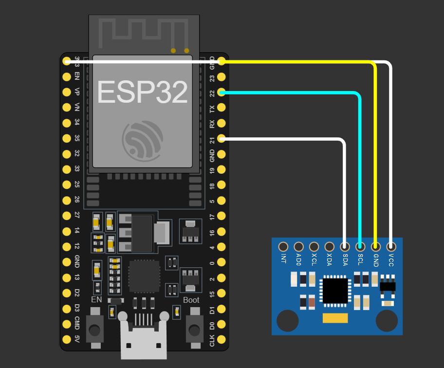

# Fall Detection with Blynk and ESP32

## Overview
This project implements a fall detection system using an ESP32 microcontroller, MPU6050 accelerometer and gyroscope sensor, and Blynk for remote monitoring. The system detects sudden falls based on accelerometer and gyroscope data and sends notifications to a Blynk mobile app.

## Features
- Real-time fall detection using accelerometer and gyroscope data.
- Integration with Blynk for remote monitoring and alerts.
- Adjustable fall detection thresholds.
- Easy to deploy and customize.

## Hardware Requirements
- ESP32 development board (e.g., ESP32 DevKitC)
- MPU6050 accelerometer and gyroscope sensor
- Jumper wires
- USB cable for programming and power supply

## Software Requirements
- Arduino IDE
- Blynk mobile app (for monitoring and receiving alerts)

## Installation
1. Connect the MPU6050 sensor to the ESP32 development board as per the wiring diagram.
2. Install the necessary libraries in the Arduino IDE: Adafruit MPU6050, Adafruit Sensor, WiFi, and Blynk.
3. Open the provided Arduino sketch (`fall_detection_blynk.ino`) in the Arduino IDE.
4. Replace the placeholder values in the sketch with your Blynk authentication token and Wi-Fi credentials.
5. Upload the sketch to your ESP32 board.

## Usage
1. Open the Blynk mobile app on your smartphone.
2. Create a new project and obtain the Blynk authentication token.
3. Add widgets to the Blynk project for monitoring and alerts (e.g., LED widget for indicating falls).
4. Run the ESP32 board with the uploaded sketch.
5. Monitor the Blynk app for fall detection alerts and status updates.

## Configuration
- Adjust the `fallThreshold` and `gyroThreshold` variables in the Arduino sketch to fine-tune the fall detection sensitivity.
- Customize the Blynk project widgets and notifications as per your preferences.

## Simulation
You can simulate this project using the Wokwi platform. 
[Click here to open the simulation](https://wokwi.com/projects/394797708706463745).

## Wiring Diagram

## Troubleshooting
- Ensure that the MPU6050 sensor is properly connected to the ESP32 board.
- Verify that the Wi-Fi credentials and Blynk authentication token are correctly set in the sketch.
- Check the serial monitor for debug messages and sensor readings to diagnose any issues.

## Acknowledgments
- This project is based on the Adafruit MPU6050 library and Blynk IoT platform.
- Special thanks to the Arduino and ESP32 communities for their contributions and support.
